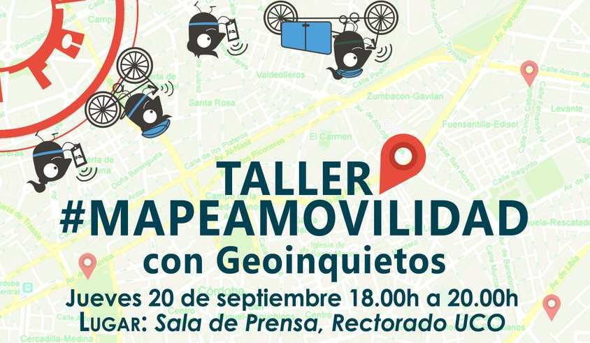

# Taller #MapeaMovilidad

## Información

###  Objetivo
El Taller "#MapeaMovilidad" se engloba dentro de las actividades que se desarrollan en la Semana Europea de la Movilidad 2018 y consistirá en añadir a OpenStreepMap la información recopilada en Twitter bajo la etiqueta #MapeaMovilidad.

El taller está organizado por la Delegación de Movilidad del Ayuntamiento de Córdoba y está coordinado por Geoinquietos Córdoba. Colabora la Universidad de Córdoba.

### Lugar

- Jueves , 20 de septiembre. 18.00h a 20.00h Taller #MapeaMovilidad con Geoinquietos . 
- Lugar: Sala Prensa Rectorado. Avda. Medina Azahara.

### Cartel
- [Enlace a cartel](https://wiki.osgeo.org/wiki/File:Mapeamovilidad2018.jpg)

### Información SEM2018

- [Programación SEM2018 Córdoba](https://sem.cordoba.es/programacion/programacion.htm)

### Páginas del Evento
- [Wiki Geoinquietos](https://wiki.osgeo.org/wiki/Taller_MapeaMovilidad_2018)
- [Evento en  Facebook](https://www.facebook.com/events/277921676378422)

### Presentación taller

- "Taller #Mapea Movilidad" Patricio Soriano. Geógrafo. @SIGdeletras y miembro del Grupo Geoinquietos Córdoba.

### Visor de mapas con los datos de OMS (117/09/2018)

- [Enlace GeoWE](http://bit.ly/mapeamovilidad_geowe)

## Taller

1. Accede a la web [http://www.sigdeletras.com/mapeamovilidad/](http://www.sigdeletras.com/mapeamovilidad/)
2. Selecciona del listado de tuits los puntos que vas a mapear
3. [Inicia sesión](https://www.openstreetmap.org/login?referer=%2F) o [regístrate](https://www.openstreetmap.org/user/new) en la web de OpenStreetMap
4. Localiza la zona donde se encuentra el punto. Usa el buscador y las herramientas de zum.
  - Si no existe, añadelo y mete sus datos
  - Si existe actualiza la información.
5. Guarda los cambios describiendo el trabajo realziado. Añade la etiqueta #MapeaMovilidad

## Listado de tuits

- [Listado](twitter/tuits.md)
- Enlace al [seguimiento del tuit #MapeaMovilidad](https://twitter.com/search?f=tweets&vertical=default&q=%23mapeamovilidad&src=typd&lang=es)

## Etiqueta Aparcamiento de bicicletas (highway:cycleway)

- "access": "public", "private", "yes", "no"
- "addr:city": "Córdoba",
- "addr:street": "Plaza de la Corredera",
- ["bicycle_parking"](https://wiki.openstreetmap.org/wiki/ES:Key:bicycle_parking): "rack", "stands", "wall_loops"...Tipo de estacionamiento para bicicletas.
- "capacity": "140", "75"
- "covered": "no", "yes"
- "name": "Estacion de Renfe", "Trasera Leroy merlin"
- "website":  Podemos usarlo para enlazar con el tuit

## Etiqueta tienda de bicicletas

- "addr:city": "Córdoba",
- "addr:housenumber": "7",
- "addr:postcode": "14002",
- "addr:street": "Plaza de la Almagra",
- "name": "La Vuelta al Mundo",
- "wheelchair": "limited"

Propias de [highway:cycleway](https://wiki.openstreetmap.org/wiki/Tag:shop%3Dbicycle)
- "service:bicycle:rental": "yes",
- "service:bicycle:repair": "yes",
- "service:bicycle:retail": "yes",

## Etiquetas Ciclovía (highway:cycleway)

- "name": "Acera bici Gran Vía Parque a Medina Azahara", "Carril bici C/ Pablo Picasso", "Via Verde de la Campina"...
- "oneway": "no", "yes" Si a los ciclistas se les permite circular en un único sentido de la ciclovía.
- ["surface"](https://wiki.openstreetmap.org/wiki/ES:Key:surface): "asphalt",  "gravel", "paved" Describe la superficie
- "segregated": "no"

